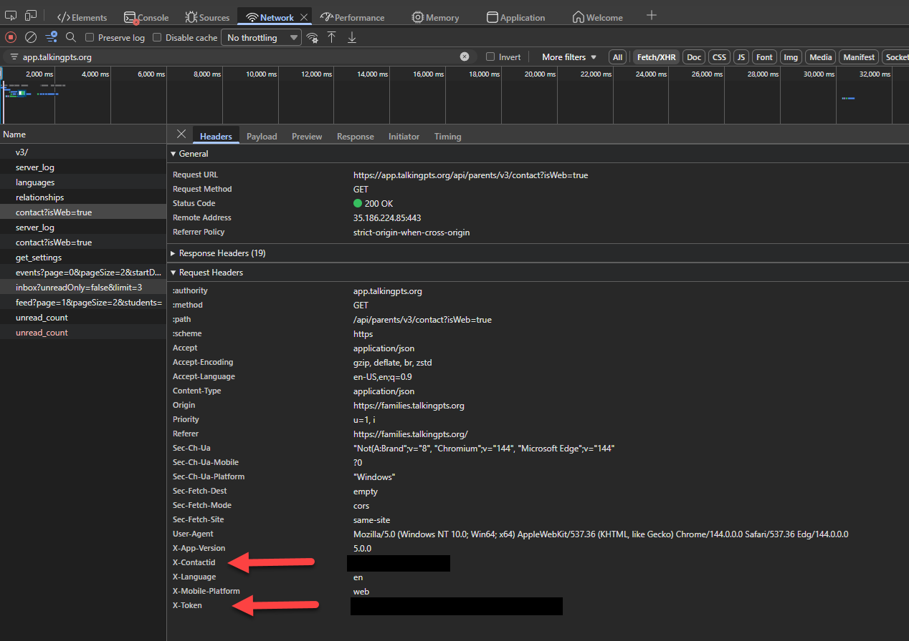

# Talking Points Summary

Talking Points Summary turns school messages from TalkingPoints into weekly email digests for parents. The repository includes a .NET 10 worker, a Blazor Server admin UI, and a .NET Aspire AppHost for local development.

## What this is

The worker fetches messages from the TalkingPoints parent feed, stores only new messages, uses Anthropic models to classify and summarize school updates, scrapes newsletter links through Browserless when needed, and emails a compiled digest through SMTP.

## Who this is for

- Developers who want to run or contribute to the worker locally
- Parents or operators who manage TalkingPoints credentials and delivery settings
- Contributors who need a local admin surface to inspect data and trigger test runs

## Repository shape

- `src/TalkingPointsSummary`: worker service and CLI
- `src/TalkingPointsSummary.Admin`: Blazor Server admin UI
- `src/TalkingPointsSummary.AppHost`: .NET Aspire local orchestrator
- `src/TalkingPointsSummary.Core`: shared models, EF Core context, and parent/child services
- `tests`: unit and integration tests

## Quick start

Choose one workflow:

- Docker Compose: run the full stack in containers
- Aspire AppHost: run the stack under Visual Studio F5 with managed dependencies
- Direct project run: run the worker and admin against services you manage yourself

### 1. Clone the repository

```bash
git clone <repo-url>
cd TalkingPointsSummary
```

### 2. Configure secrets and local settings

For Docker Compose, start from the checked-in example file:

```bash
cp .env.example .env
```

Edit `.env` and set at least:

- `ANTHROPIC_API_KEY`
- `SMTP_FROM`

For direct worker runs, set user secrets on the worker project:

```bash
cd src/TalkingPointsSummary
dotnet user-secrets set "ConnectionStrings:TalkingPoints" "Host=localhost;Database=talkingpoints;Username=postgres;Password=postgres"
dotnet user-secrets set "Anthropic:ApiKey" "your-anthropic-key"
dotnet user-secrets set "Smtp:FromEmail" "you@example.com"
```

Set `Smtp:Username` and `Smtp:Password` only when your SMTP server requires authentication. In Development, the worker already overrides SMTP defaults to `localhost:1025`, which matches Mailpit.

### 3. Start the stack

#### Docker Compose

```bash
docker compose up -d --build
```

That starts:

- the worker container `talking-points-summary`
- the admin UI at `http://localhost:5100`
- Browserless at `http://localhost:3000`
- Mailpit at `http://localhost:8025`
- PostgreSQL at `localhost:5432`

The Compose worker is not published on a host port. The admin container talks to it internally at `http://app:8080/`.

#### Aspire AppHost

Set `TalkingPointsSummary.AppHost` as the startup project and press F5. The AppHost manages PostgreSQL, Browserless, and Mailpit by default, injects `ConnectionStrings__TalkingPoints`, forces `DebugFeatures__Enabled=true` for the worker and admin, and points the admin debug client at `http://127.0.0.1:5101/`.

See `docs/F5-DEBUGGING.md` for the dependency flags and launch profile details.

### 4. Register a parent and children

#### Getting TalkingPoints credentials

You need two headers from an authenticated TalkingPoints parent session:

- `x-token`
- `x-contactid`

To get them:

1. Open `https://families.talkingpts.org/login`.
2. Sign in with the parent account you want to summarize.
3. Open your browser developer tools.
4. Open the `Network` tab and refresh the page.
5. Select any authenticated TalkingPoints API request.
6. Open `Headers` and copy `x-token` and `x-contactid` from `Request Headers`.



Treat both values as secrets.

You can register parents and children in either interface:

- Admin UI: open `http://localhost:5100/parents`, select `Add Parent`, then open the parent record and select `Add Child`
- CLI: use the commands below from the worker container

The admin UI uses the same parent and child services as the CLI. The parent form also includes inline guidance for finding `x-token` and `x-contactid` in your browser dev tools.

CLI example:

```bash
docker exec talking-points-summary \
  dotnet TalkingPointsSummary.dll add-parent \
  --name "ExampleFamily" \
  --token "your-talkingpoints-x-token" \
  --contact-id "your-talkingpoints-x-contactid" \
  --emails "parent1@example.com;parent2@example.com"

docker exec talking-points-summary \
  dotnet TalkingPointsSummary.dll add-child \
  --parent-id 1 \
  --name "StudentOne" \
  --school "Sample Elementary" \
  --grade 0 \
  --emoji "📚"
```

### 5. Verify configuration and run the pipeline

Check configuration and connectivity:

```bash
docker exec talking-points-summary \
  dotnet TalkingPointsSummary.dll check-config
```

Run the pipeline manually for all active parents:

```bash
docker exec talking-points-summary \
  dotnet TalkingPointsSummary.dll run
```

Use the admin UI at `http://localhost:5100` to add and manage parents and children, inspect stored data, and, when debug features are enabled, trigger manual runs from the debug page. Use Mailpit at `http://localhost:8025` to inspect delivered email.

## Configuration

The worker loads configuration in this order:

1. `src/TalkingPointsSummary/appsettings.json`
2. `src/TalkingPointsSummary/appsettings.{Environment}.json`
3. `src/TalkingPointsSummary/appsettings.Local.json` if present
4. Development user secrets for `src/TalkingPointsSummary`
5. Environment variables

### Worker settings

| Setting | Environment variable | Default | Required | Notes |
| --- | --- | --- | --- | --- |
| `ConnectionStrings:TalkingPoints` | `ConnectionStrings__TalkingPoints` | empty | Yes | PostgreSQL connection string |
| `Anthropic:ApiKey` | `Anthropic__ApiKey` | empty | Yes | Used by both message categorization and summary generation |
| `Browserless:BaseUrl` | `Browserless__BaseUrl` | `http://browserless:3000` | Yes | Must be an absolute URL |
| `DebugFeatures:Enabled` | `DebugFeatures__Enabled` | `false` | No | When `true`, the worker runs the debug web host and exposes `POST /debug/pipeline/run-now` |
| `NewsletterScrapingSecurity:Enabled` | `NewsletterScrapingSecurity__Enabled` | `true` | No | Enables URL validation before Browserless is called |
| `NewsletterScrapingSecurity:RequireHttps` | `NewsletterScrapingSecurity__RequireHttps` | `true` | No | Blocks non-HTTPS newsletter URLs unless explicitly allowed |
| `NewsletterScrapingSecurity:AllowedHosts` | `NewsletterScrapingSecurity__AllowedHosts__0`, etc. | empty list | No | Host allowlist for newsletter scraping |
| `NewsletterScrapingSecurity:AllowHttpHosts` | `NewsletterScrapingSecurity__AllowHttpHosts__0`, etc. | empty list | No | Hosts that may use `http` when scraping is enabled |
| `TalkingPointsApi:MaxPagesPerRun` | `TalkingPointsApi__MaxPagesPerRun` | `3` | No | Fetch limit; each page contains up to 20 messages |
| `Smtp:Host` | `Smtp__Host` | `smtp.gmail.com` in base config, `localhost` in Development | Yes | SMTP hostname |
| `Smtp:Port` | `Smtp__Port` | `587` in base config, `1025` in Development | Yes | SMTP port |
| `Smtp:Username` | `Smtp__Username` | empty | No | Must be paired with `Smtp:Password` |
| `Smtp:Password` | `Smtp__Password` | empty | No | Must be paired with `Smtp:Username` |
| `Smtp:FromEmail` | `Smtp__FromEmail` | empty in base config, `dev@example.com` in Development | Yes | Sender address |
| `PipelineSchedule:DayOfWeek` | `PipelineSchedule__DayOfWeek` | `1` | No | Weekly schedule day in UTC, where `0=Sunday` and `1=Monday` |
| `PipelineSchedule:Hour` | `PipelineSchedule__Hour` | `8` | No | Weekly schedule hour in UTC |

### AppHost settings

The AppHost has its own configuration in `src/TalkingPointsSummary.AppHost/appsettings.json` and user secrets.

| Setting | Default | Notes |
| --- | --- | --- |
| `ManagePostgres` | `true` | Starts a local PostgreSQL 15 container and injects `ConnectionStrings__TalkingPoints` |
| `ManageBrowserless` | `true` | Starts a Browserless container and injects `Browserless__BaseUrl` |
| `ManageMailpit` | `true` | Starts Mailpit and injects `Smtp__Host` and `Smtp__Port` into the worker |
| `Browserless:BaseUrl` | `null` | Required only when `ManageBrowserless=false` |
| `WorkerArgs` | unset | Optional CLI arguments forwarded to the worker, for example `run` or `check-config` |

## How the pipeline works

1. The scheduler waits for the next configured UTC day and hour, runs immediately if the worker starts during that scheduled hour, and retries once per minute within that same hour when a scheduled run is blocked or fails. The default schedule is Monday at 08:00 UTC.
2. For each active parent, the worker fetches TalkingPoints feed pages of 20 messages each.
3. Fetching stops when it reaches the newest stored message ID, when it sees a message older than the newest stored timestamp, when a short or empty page is returned, or when `TalkingPointsApi:MaxPagesPerRun` is reached.
4. The deduplicator stores only messages whose `(ParentId, ExternalMessageId)` pair does not already exist in the database.
5. The categorizer sends each unprocessed message to Anthropic Haiku and decides whether the message contains a newsletter URL, whether the message text is itself newsworthy, and what short summary text to persist.
6. If a newsletter URL is present, the worker validates the URL, scrapes the page body through Browserless, and stores the scrape result as a `NewsItem`. If scraping fails or returns empty content, the worker falls back to storing the original message text.
7. The summary generator loads up to six weeks of `NewsItems` and six weeks of previous `Summaries` for that parent, then asks Anthropic Sonnet to produce the weekly Markdown digest.
8. The worker converts Markdown to HTML, sends the email through SMTP, stores the Markdown summary, and records scheduled run state to avoid duplicate scheduled executions for the same day.

## Data model

| Table | Purpose |
| --- | --- |
| `Parents` | Parent records, TalkingPoints credentials, recipient emails, and active status |
| `Children` | Child records with school, starting grade, starting year, and emoji |
| `Messages` | Raw TalkingPoints messages, keyed uniquely per parent by external message ID |
| `NewsItems` | Persisted message-derived or newsletter-derived content with source type |
| `Summaries` | Archived Markdown summaries |
| `PipelineRuns` | Scheduled run tracking with trigger, status, timestamps, and error text |

## Local development

- Use `docs/CLI.md` for the CLI command reference.
- Use `docs/F5-DEBUGGING.md` for Visual Studio and AppHost debugging.
- Run `dotnet build TalkingPointsSummary.sln` from the repo root to build the solution.
